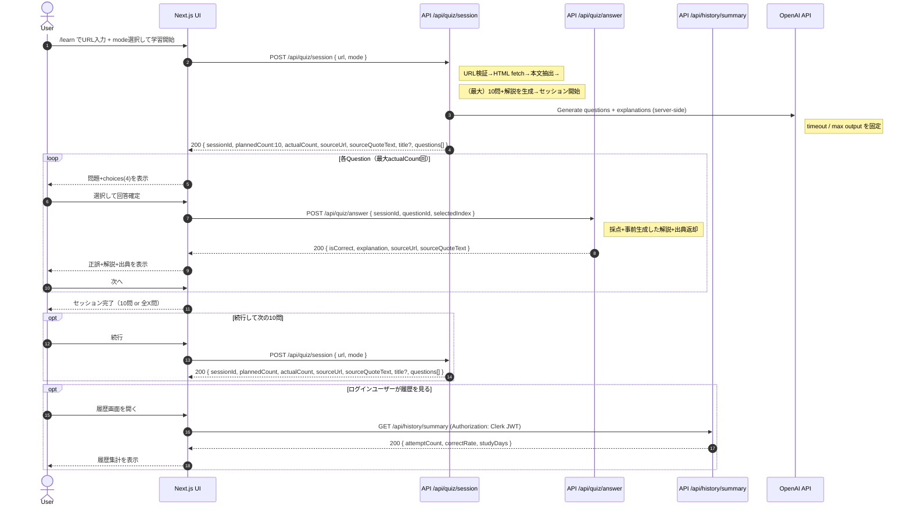

# Sequence: クイズ学習フロー（APIの役割整理）

**Created**: 2026-01-04  
**Spec**: [spec.md](spec.md)  
**Contracts**: [contracts/openapi.yaml](contracts/openapi.yaml)
**UI**: [ui.md](ui.md)

## 目的

`/api/quiz/session` に URL入力〜教材抽出〜出題開始を一本化した構成において、ユーザーがクイズ学習する一連のフロー（URL入力→出題→回答→解説）をシーケンス図で示す。

補足: 画面構成（各ページで何を表示するか）と画面遷移は [ui.md](ui.md) にまとめる。

## APIの役割（要約）

- `/api/quiz/session`: 入力URLを教材として扱い、URL検証→HTML fetch→本文抽出→（最大）10問生成→セッション開始を行う（mode は word/reading）
- `/api/quiz/answer`: 回答を採点し、解説（英語の意味 / 技術背景 / 使用シーン）と出典（quote + URL）を返す
- `/api/history/summary`: ログインユーザーの学習履歴集計を返す（attemptCount / correctRate / studyDays）

OpenAI API（server side only）の利用ポイント:

- session start 時（`/api/quiz/session`）: 本文抽出結果を入力に、問題（prompt/choices/correctIndex）と「各Questionにつき1つの解説」をまとめて生成
- answer 時（`/api/quiz/answer`）: OpenAIは呼ばず、事前生成した解説を返す（採点はサーバで実施）

## シーケンス図（Mermaid）



## 補足（一本化の意図）

- MVPでは「入力URL（1ページ）」をその場で教材として扱えば十分なため、教材作成専用のAPIを分けずにセッション開始APIへ統合する。
- これにより、UIからは「URL + mode でセッション開始」だけを呼べばよくなり、フローが単純になる。

## OpenAI API request（例）

以下は実装依存を避けた概念例（擬似JSON）であり、実際の payload は server 側の都合に合わせて調整する。

### 1) `POST /api/quiz/session` 内：問題生成

- Input:
  - extracted text（本文抽出結果）
  - mode（word/reading）
  - 制約（4 choices、function words exclude、最大10問、各Questionにつき解説は1つ）

例:

```json
{
  "model": "<model>",
  "response_format": { "type": "json_schema", "json_schema": "<QuestionsSchema>" },
  "input": [
    {
      "role": "system",
      "content": "You generate multiple-choice questions from technical docs. Output JSON only."
    },
    {
      "role": "user",
      "content": {
        "mode": "word",
        "maxQuestions": 10,
        "rules": ["4 choices", "exclude function words"],
        "documentText": "<extractedText>"
      }
    }
  ],
  "max_output_tokens": 800,
  "timeout_ms": 2000
}
```

### 2) `POST /api/quiz/answer` 内：解説返却（OpenAI callなし）

- Input:
  - sessionId/questionId（どの解説を返すか）
  - user selectedIndex（採点）

Notes:
- `/api/quiz/answer` は OpenAIを呼ばず、session start 時に生成済みの解説を返す

Notes:
- OpenAI API call は browser から直接呼ばず、必ず server side で実行する
- SC-001 を意識し、timeout と max output を固定する（過剰生成を防ぐ）
